```{r setup}
library(tidyverse)
library(adas.utils)
library(latex2exp)
library(patchwork)
```


# Catena di misura
È un sistema composto da una serie di strumenti collegati che elaborano un segnale per ottenere una misurazione

## Definizioni

:::columns
:::column
* **misurando**: oggetto fisico della misurazione
* **trasduttore**: dispositivo che converte una grandezza fisica in un'altra
* **condizionatore**: dispositivo che migliore il segnale fisico prodotto dal trasduttore
* **conversione AD**: trasforma un segnale analogico in un segnale digitale
* **acquisizione**: opera sul segnale digitale (visualizzazione, registrazione, elaborazione, ecc.)
:::

:::column
<!-- Static render of images/catena.dot. A ```{dot} cell here would make
     Quarto launch headless Chrome to rasterise the graph for the PDF pass,
     which hangs intermittently on CI runners and stalls the whole build.
     Regenerate with: dot -Tsvg images/catena.dot -o images/catena.svg -->
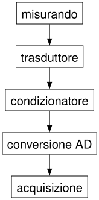{width=260}
:::
:::

## Esempio: misura estensimetrica

:::center
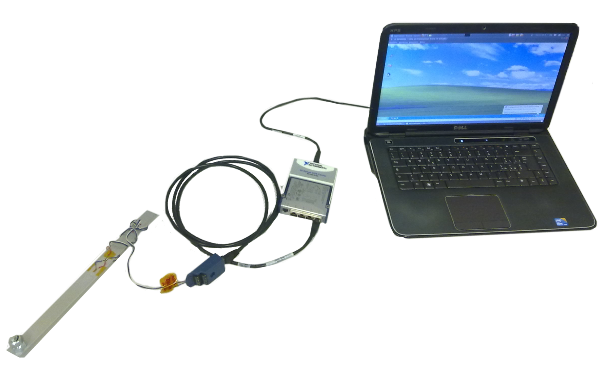{width=800}
:::


# Trasduttori di posizione
Cioè come rilevare la posizione di un oggetto mobile

## Trasduttore capacitivo

:::columns
:::column
La **capacità** è espressa da: $C=\varepsilon_r A/d$

* adatto per misure di spostamento con $d$ molto piccolo e elevata sensibilità (ordine dei nanometri)
* **non è lineare** (varia con $1/d$)
* elevata impedenza, quindi necessita di schermatura
* sensibile a $\varepsilon_r$ (temperatura, umidità)
:::

:::column

:::
:::


## Trasduttore induttivo diretto

:::columns
:::column
Sfruttando la **variazione di induttanza** che risulta da uno spostamento dell'armatura:

* Semplice
* Sensibile a effetti ambientali
:::

:::column
{width=600}
:::
:::


## Trasduttore induttivo differenziale

:::columns
:::column
**Linear Variable Differential Transformer**: sfrutta la **differenza** tra due avvolgimenti secondari per movimenti opposti del core:

* più complesso e costoso
* auto-compensato per gli effetti ambientali
* più sensibile
:::

:::column
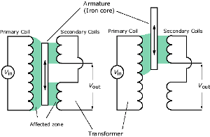{width=400}
:::
:::

## Trasduttore resistivo

:::columns
:::column
Sfrutta una variazione di resistenza in un circuito parallelo $R_{T} = (1-\Delta)R_v \frac{1}{\Delta R_v + R_{sc}}$

* economico
* corse discretamente lunghe
* usura
* misura rumorosa
:::

:::column
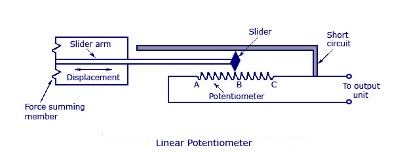{width=600}
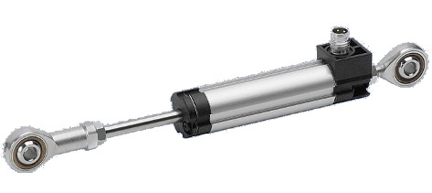

:::
:::


## Trasduttore interferometrico

:::columns
:::column
È basato su un conteggio di oscillazioni su una misura di intensità luminosa

* Risoluzione almeno nanometrica, dell'ordine della lunghezza d'onda
* Lunghezze molto grandi (nel vuoto anche milioni di kilometri)
* Sensibile alle proprietà ottiche del mezzo (funzione della temperatura e umidità, se è aria)
:::

:::column
::: {.content-visible when-format="html"}

:::
::: {.content-visible when-format="pdf"}
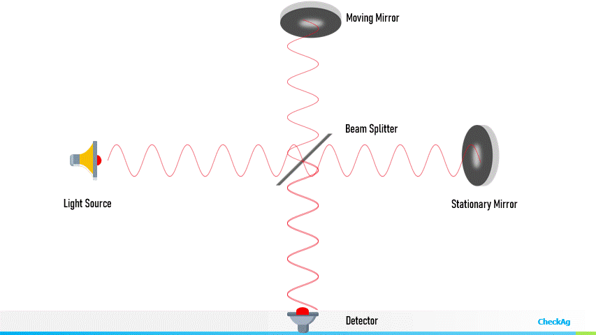
:::
:::
:::


## Trasduttore con fotodiodo a quadrante

:::columns
:::column
* Un fascio laser illumina 4 fotodiodi disposti a quadrante
* La **differenza** tra le correnti generate tra fotodiodi affiancati è proporzionale allo spostamento del fascio in $X$ e in $Y$
* Sensibilità molto elevata
* Corsa limitata
* Bassa **linearità**
:::

:::column
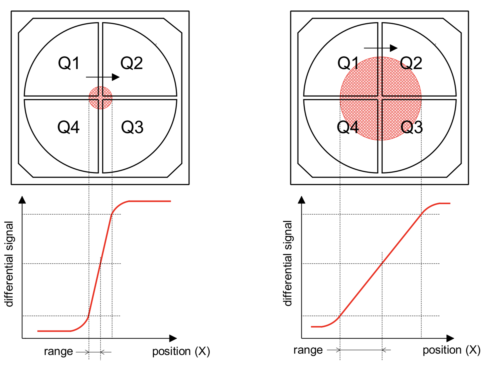
:::
:::


## Encoder a riga ottica (relativi)

:::columns
:::column
* Misurano uno spostamento rispetto a un riferimento per **conteggio** di una serie di impulsi
* Gli impulsi derivano da una griglia di alternanze (trasparente/opaco, poli N/S)
* Due griglie sfasate di 1/4 di periodo consentono di valutare la **direzione** di moto
* Risoluzione fino a 0.1 µm
:::

:::{.column style="text-align: center;"}
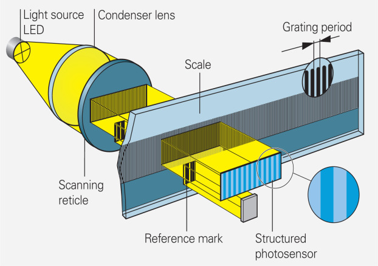{width=400}
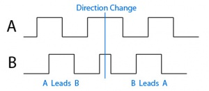
:::
:::


## Encoder a riga ottica (assoluti)

:::columns
:::column
* Ogni posizione è identificata in maniera **univoca** da una sequenza di segnali binari (bianco/nero, N/S)
* Non serve un contatore e la misura è assoluta, non relativa a uno 0
* Serve un numero di detector $n$ (segnali) che dipende dal **numero di posizioni** $N$: $n=\lceil\log_2(N)\rceil$
:::

:::column
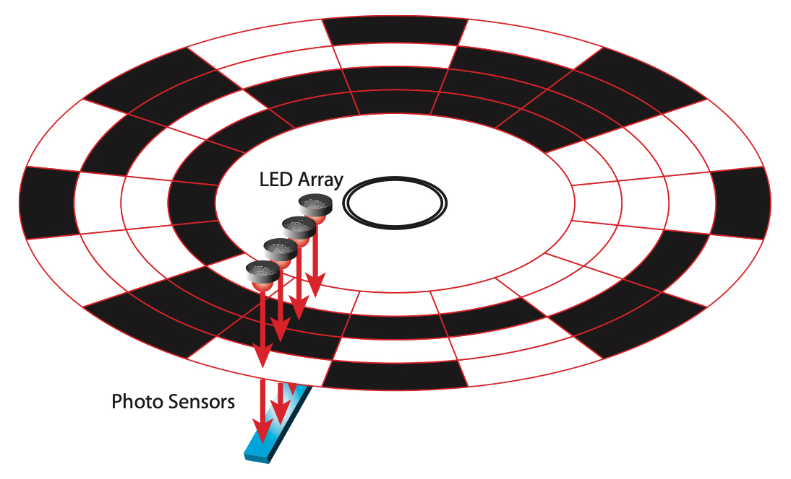
:::
:::

:::callout-note
La notazione $\lceil x \rceil$ indica l'arrotondamento all'intero superiore (*ceiling*)
:::

# Celle di carico e misure di forza
Da misure di deformazione a misure di forza

## Principali metodi per misurare una forza

* Bilanciando la forza incognita contro la forza gravitazionale che agisce su una massa nota
* Misurando l'accelerazione di una massa nota sotto l'azione della forza incognita
* Bilanciando una forza magnetica che agisce contro la forza incognita
* Misurando il cambiamento di frequenza propria di un cavo messo in tensione dalla forza incognita
* Misurando la deformazione di un elemento elastico a cui si applica la forza incognita


## Bilancia analitica

:::columns
:::column
* Concettualmente semplice
* Può essere puramente meccanica
* Precisione dipende dalla qualità delle lavorazioni
:::

:::column
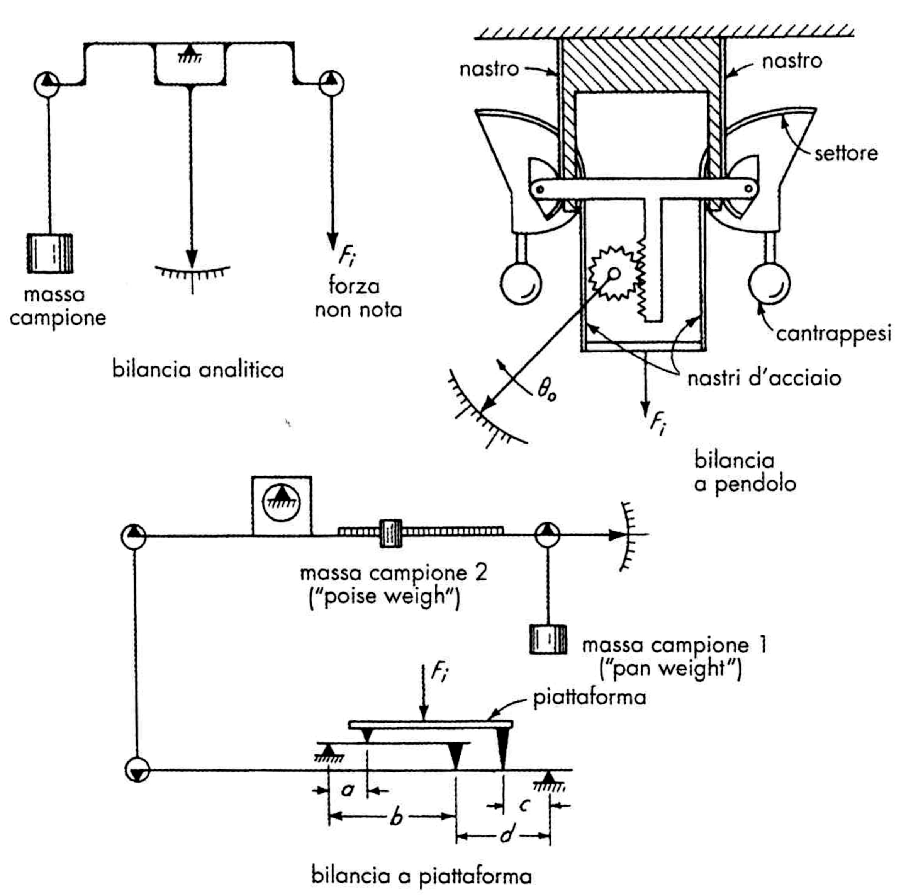
:::
:::


## Trasduttore accelerometrico

:::columns
:::column

* Da $F=Ma$, nota la massa e misurando l'accelerazione si risale alla forza applicata
* È adatta a **misure dinamiche**, in cui la forza è variabile nel tempo
* Richiede l'**accelerometro**, che è a sua volta uno strumento di misura (con un trasduttore interno che misura uno spostamento o una deformazione di una massa nota)

:::

:::column
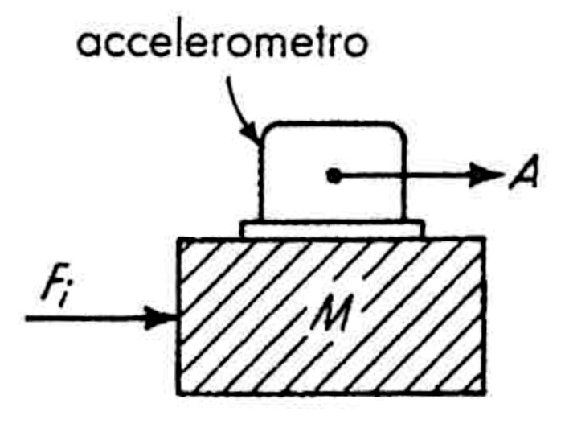{width=300}
:::
:::


## Bilancia elettromagnetica

:::columns
:::column
* Sono basate su un **trasduttore di posizione**
* Lo scostamento rispetto a una posizione di riferimento è mantenuto nullo alimentando proporzionalmente un avvolgimento elettromagnetico
* La la corrente che alimenta l'avvolgimento è proporzionale alla forza incognita
* la bilancia può essere molto più compatta e più pronta delle bilance analitiche
* **richiede un'alimentazione e un controllore**
:::

:::column
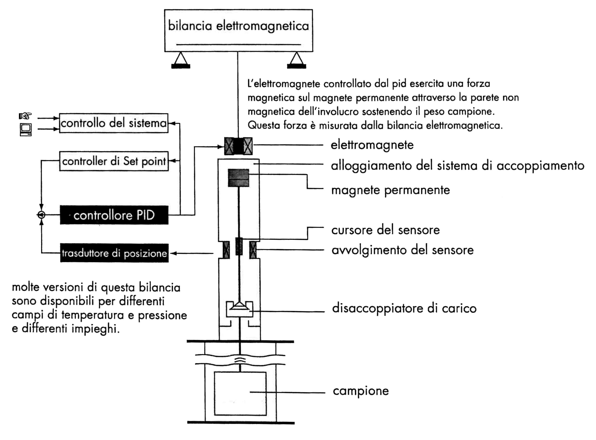
:::
:::

## Bilancia a vibrazione

* La frequenza di vibrazione di una corda tesa dipende dalla tensione
* Il trasduttore è un **analizzatore di spettro**, in grado di convertire un suono (vibrazione) in una misura di frequenza


## Dinamometro a elementi deformabili (cella di carico)

:::columns
:::column
* Il trasduttore converte una **deformazione meccanica** in un segnale elettrico
* È adatto sia a misure statiche che a misure dinamiche
* È possibile compensare gli effetti interferenti e modificanti della temperatura
:::

:::column
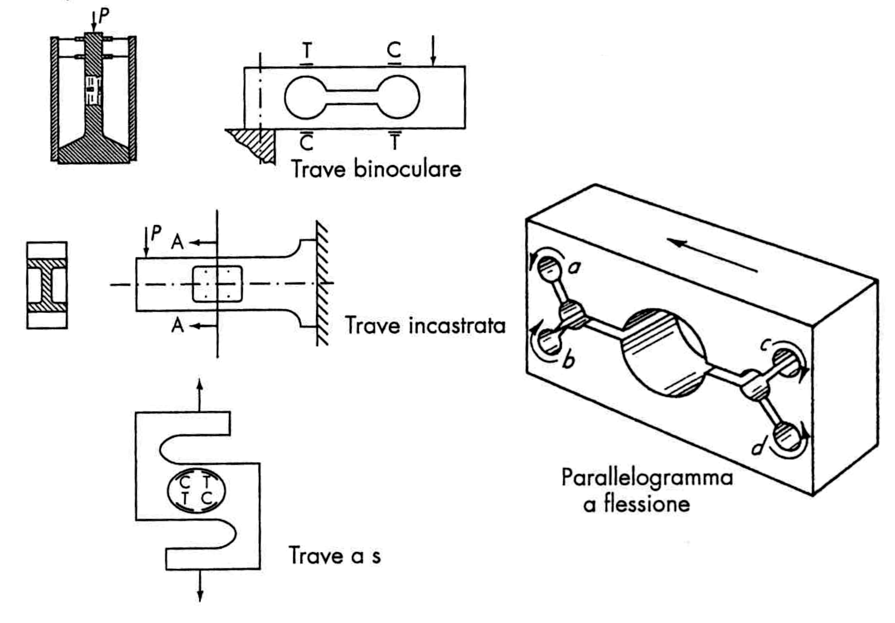
:::
:::


# Trasduttori di deformazione
Cioè come rilevare l'intensità della deformazione di un corpo

## Sforzo e deformazione in campo elastico

:::columns
:::column
In campo elastico la deformazione di un solido è **reversibile e lineare**

* Vale la **legge di Newton**: $\sigma = E \varepsilon$ dove $\sigma = F/A$ e $\varepsilon=\Delta L / L_0$
* $E$ è il **modulo di Young**, o modulo elastico, ed è una proprietà del materiale
* La legge di Newton consente di misurare uno stato di sforzo a partire da uno stato di deformazione
:::

:::column
```{r}
E <- 200E6
tibble(
  epsilon=seq(0, 0.1, length.out = 10),
  sigma = E*epsilon
) %>% 
  ggplot(aes(x=epsilon, y=sigma/1000)) +
  geom_line() + 
  labs(x=TeX("\\epsilon (mm/mm)"), y=TeX("\\sigma (kN)"))
```
:::
:::

## Stati tensionali multiassiali

Sforzo e deformazione sono rappresentati da **tensori**: in ogni punto assumono valori nelle tre direzioni spaziali.

Ad esempio in 2-D:

:::columns
:::column
### Sforzi tensionali:
Deformazioni ($\varepsilon$):
$$
\varepsilon_x = \frac{\sigma_x}{E}- \nu \frac{\sigma_y}{E},~~~\varepsilon_y = \frac{\sigma_y}{E}- \nu \frac{\sigma_x}{E}
$$
Quindi:
$$
\sigma_x = \frac{E(\varepsilon_x + \nu\varepsilon_y)}{1-\nu^2},~~~ \sigma_y = \frac{E(\varepsilon_y + \nu\varepsilon_x)}{1-\nu^2}
$$
:::

:::column
### Sforzo a taglio:
Sforzo ($\gamma$) e deformazione ($\tau$) di taglio
$$
\gamma_{xy} = \frac{\tau_{xy}}{G}
$$

Dove il modulo di taglio $G$ è:
$$
G=\frac{E}{2(1+\nu)}
$$

:::
:::

## Stati tensionali multiassiali

Quindi, se posso misurare lo stato tensionale (deformazioni), posso ricavare lo stato di sforzo (sollecitazione) e capire quanto un dato sistema è **in sicurezza**

La misurazione dello stato tensionale può essere 

* **puntuale**, cioè localizzata su un'area/volume più piccolo possibile, tipicamente comparabile al grado di omogeneità del materiale
* **media**, cioè valutata su una lunghezza base elevata, in modo da mediare l'effetto di variazioni locali


## Come si misurano 

* **Estensimetri meccanici (a leva meccanica)**:  sono stati i primi ad essere sviluppati in ambito industriale, ma non avendo un accettabile rapporto tra livello di accuratezza e costi di realizzazione, sono stati soppiantati da altri tipi. Un altro limite è costituito dal fatto che gli elementi meccanici presentano inevitabilmente **inerzia e attriti** che non consentono di fare misure di deformazioni dinamiche
* **Estensimetri ottici** (a leva ottica, fotoelastici, interferometrici):  garantiscono elevate accuratezze, ma a causa dell'elevato costo sono generalmente impiegati solo in laboratori metrologici
* **Estensimetri acustici**:  usano il principio della corda vibrante, ovvero il fatto che una corda vibrante emette onde sonore a differente frequenza a seconda della tensione della corda
* **Estensimetri elettrici a resistenza**: i più diffusi e più economici, realizzabili in diverse dimensioni, generalmente di ottima accuratezza, con facile circuito di lettura


## Trasduttore estensimetrico a resistenza

:::columns
:::column
Sono basati su principio che l'allungamento di un conduttore provoca una aumento di resisteza proporzionale all'allungamento stesso

La sensibilità è aumentata ripiegando il conduttore su se stesso più volte

* Un **estensimetro** (*strain gauge*) fornisce una misura puntuale (mediata sulla lunghezza della *patch*)
* Un **estensometro** (*extensometer*) fornisce una misura media mediante un meccanismo a leve che deforma un estensimetro
:::

:::{.column style="text-align: center;"}
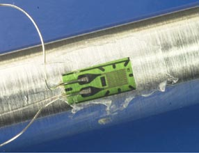
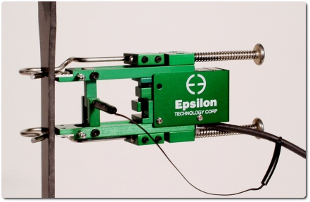
:::
:::

## Leggi dell'estensimetria

La resistenza elettrica è $R=\rho L/A$, con $L$ lunghezza, $A$ sezione e $\rho$ resistività

In termini di variazione:

\begin{align}
\frac{\Delta R}{R} &= \frac{1}{R}\left( \frac{\partial R}{\partial\rho}\Delta \rho + \frac{\partial R}{\partial L}\Delta L +\frac{\partial R}{\partial A}\Delta A \right) = \frac{A}{\rho L}\left(\Delta \rho \frac{L}{A} + \Delta L \frac{\rho}{A} - \Delta A (\rho L)\right) \\
&=\frac{\Delta \rho}{\rho} + \frac{\Delta L}{L} - \frac{\Delta A}{A}
\end{align}

Rappresentando l'area mediante un fattore di forma $C$ e un parametro caratteristico $D$ si ha:

$$
A=CD^2 \rightarrow \frac{\Delta A}{A} = 2\frac{\Delta D}{D} \rightarrow \frac{\Delta R}{R} = \frac{\Delta \rho}{\rho} + \frac{\Delta L}{L} - 2\frac{\Delta D}{D}
$$

## Leggi dell'estensimetria

Siccome $\varepsilon_t = -\nu \varepsilon_l$, risulta che $\Delta D/D = -\nu\Delta L/L$, e quindi:

$$
\frac{\Delta R}{R} = \frac{\Delta \rho}{\rho} + \frac{\Delta L}{L} - 2\left(-\nu\frac{\Delta L}{L}\right) = \frac{\Delta \rho}{\rho} + \frac{\Delta L}{L} (1 +2\nu)
$$

:::columns
:::column
Sostituendo $\varepsilon_l = \Delta L/L$ si ha la **prima legge dell'estensimetria**:

\begin{align}
\frac{\Delta R}{R} &= \varepsilon_l\frac{\Delta \rho}{\rho \varepsilon_l}+\varepsilon_l(1+2\nu) \\
 &= \varepsilon_l\left(\frac{\Delta \rho}{\rho \varepsilon_l}+1+2\nu\right) =\varepsilon_l G_F
\end{align}
:::

:::column

:::callout-note
* $\Delta \rho/(\rho \varepsilon_l)$ è la **sensibilità piezoresistiva** (per metalli: $s_p\simeq 0.4$); non dipende da $\varepsilon_l$
* $1 + 2\nu$ è la **sensibilità geometrica** ($\nu \simeq 0.3$, quindi $s_g \simeq 1.6$)
* $G_F$ è il *gauge factor*
:::

:::
:::


## Effetto della temperatura

La temperatura ha effetto:

* **interferente**, perché la variazione di resistenza dovuta alla dilatazione termica e all'effetto termoresistivo ($\rho=\rho(T)$) si sommano alla misura
* **modificante**, perché la temperatura modifica il valore del gauge factor per via della **sensibilità piezoresistiva** $\Delta \rho/(\varepsilon_l \rho)$

:::callout-note
Questi termini vanno compensati o automaticamente, o note le relazioni con la temperatura, e comunque sempre mediante controllo statistico (**casualizzazione della sequenza**)
:::

## Effetto interferente della temperatura

Effetto termoresistivo: la **resistività** $\rho_T$ alla temperatura $T$ è

$$
\rho_T - \rho_0= \rho_0\alpha_\rho \Delta T
$$
e quindi, in termini di variazione di resistenza rispetto alla temperatura di riferimento $T_0$:
$$
\Delta R_\rho = R(T) - R(T_0) = R_0\alpha_\rho\Delta T
$$

Cioè: $\frac{\Delta R_\rho}{R_0} = \alpha_\rho\Delta T$

:::callout-note
Il coefficiente $\alpha_\rho$ è il coefficiente di sensibilità termica della resistività; la relazione può considerarsi lineare per variazioni modeste di temperatura (decina di gradi C)
:::

## Effetto interferente della temperatura

Effetto della dilatazione termica: la variazione di temperatura agisce dilatando sia l'estensimetro che il materiale, in modo potenzialmente differente. Ne consegue una deformazione dell'estensimetro:

$$
\Delta L_{\Delta T} = L_0 (\alpha_m - \alpha_g)\Delta T\rightarrow\frac{\Delta L_{\Delta T}}{L_0}=\varepsilon_{\Delta T}=(\alpha_m - \alpha_g)\Delta T
$$

In termini di variazione di resistenza associata:

$$
\frac{\Delta R_{\Delta L}}{R_0} = G_F(\alpha_m - \alpha_g)\Delta T
$$
Combinando:

$$
\frac{\Delta R_{\Delta T}}{R_0} = \frac{\Delta R_{\Delta L}}{R_0} + \frac{\Delta R_\rho}{R_0} = \left(\alpha_\rho + G_F(\alpha_m - \alpha_g) \right)\Delta T
$$

## Autocompensazione

Dato che:

$$
\frac{\Delta R_{\Delta T}}{R_0} = \left(\alpha_\rho + G_F(\alpha_m - \alpha_g) \right)\Delta T
$$

in certi casi è possibile scegliere un materiale dello strain gauge (e quindi un valore di $\alpha_g$) tale che sia

$$
G_F(\alpha_m - \alpha_g)\approx\alpha_\rho
$$
e, quindi, risulti $\frac{\Delta R_{\Delta T}}{R_0} \approx 0$

:::callout-note
In questo caso lo strain gauge si dice **autocompensato in temperatura**
:::


## Effetto modificante della temperatura

* L'effetto  modificante è connesso alla dipendenza dalla temperatura del termine piezoresistivo che compare nella formula del fattore di taratura $G_F$
* I materiali comunemente adottati per gli estensimetri elettrici a resistenza, e in particolare la costantana, manifestano un ridotto contributo piezoresistivo al fattore di taratura, di conseguenza anche l'effetto modificante non ha rilevanza nell'impiego a temperatura ambiente, in particolare indicata con $T_0=24^\circ\mathrm{C}$ per un campo di temperature compreso in $\pm25^\circ\mathrm{C}$ rispetto $T_0$, l'eventuale correzione da apportare al fattore di taratura è minore del 0.5% e quindi solitamente dello stesso ordine di grandezza dell'incertezza con cui è noto tale parametro
* La compensazione dell'effetto $G_F=G_F(T)$ viene calibrata empiricamente dal costruttore che fornisce la **sensitività** $\beta$ in:
$$
G_F(T) = G_{F,0} (1 - \beta(T- T_0))
$$


## Misura della variazione di resistenza

:::columns
:::column

* Le misure differenziali sono sempre preferibili perché danno maggiore **sensibilità**
* Nel circuito a **ponte di Wheatstone** se le resistenze sono tutte uguali il ponte è detto **bilanciato** e $V_\mathrm{out}=0$
* In generale vale:

$$
V_\mathrm{out} = \frac{V_\mathrm{in}}{4}\left( \frac{\Delta R_1}{R_1} -  \frac{\Delta R_2}{R_2} + \frac{\Delta R_3}{R_3} - \frac{\Delta R_4}{R_4}\right)
$$

:::

:::column
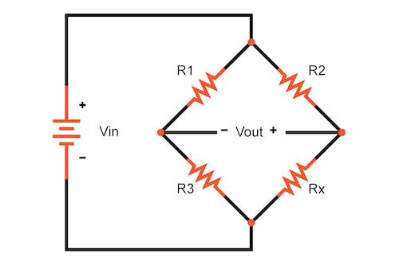
:::
:::

:::callout-note
Cioè: variazioni su rami adiacenti si sottraggono; variazioni su rami opposti si sommano!
:::


## Misura della variazione di resistenza: quarto di ponte

:::columns
:::column

Se una delle 4 resistenze è un estensimetro resistivo:

$$
V_\mathrm{out} = \frac{V_\mathrm{in}}{4}\left( \frac{\Delta R_1}{R_1}\right) = \frac{V_\mathrm{in}}{4}G_F\varepsilon_l
$$
:::

:::column

:::
:::


## Misura della variazione di resistenza: mezzo ponte

:::columns
:::column

Se sue resistenze adiacenti sono ER, la seconda può compensare la temperatura:

$$
V_\mathrm{out} = \frac{V_\mathrm{in}}{4}\left( \frac{\Delta R_1}{R_1} - \frac{\Delta R_2}{R_2}\right) 
$$
Se sue resistenze opposte sono ER, la combinazione aumenta la sensibilità:

$$
V_\mathrm{out} = \frac{V_\mathrm{in}}{4}\left( \frac{\Delta R_1}{R_1} + \frac{\Delta R_3}{R_3}\right) 
$$
:::

:::column

:::
:::


## Misura della variazione di resistenza: ponte intero

:::columns
:::column

Si usano 4 ER, a due a due compensati in temperatura e raddoppiando la sensibilità

$$
V_\mathrm{out} = \frac{V_\mathrm{in}}{4}\left( \frac{\Delta R_1}{R_1} -  \frac{\Delta R_2}{R_2} + \frac{\Delta R_3}{R_3} - \frac{\Delta R_4}{R_4}\right)
$$
:::

:::column

:::
:::


## Dinamometro a mensola

:::columns
:::column
Nell'esercizio sul dinamometro a mensola si è usata l'espressione:
$$
V=3/2GV_i\frac{lG_F}{EBH^2}F+V_0
$$
Per una trave snella la deformazione massima è:
$$
\varepsilon_l = \frac{6l}{EBH^2}F
$$

:::

:::column
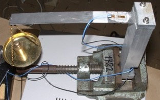{width=500}
:::
:::

e per il quarto di ponte si ha (con $V_i=GV_\mathrm{in}$ e $V_0$ che è la **tara**):
\begin{align}
V_\mathrm{out} &= \frac{V_\mathrm{in}}{4}\left( \frac{\Delta R_1}{R_1}\right) = \frac{V_\mathrm{in}}{4}G_F\varepsilon_l \\
\frac{V}{V_\mathrm{in}} &= \frac{\varepsilon_l}{4}G_F = \frac{6l}{4EBH^2}F G_F = 3/2\frac{lG_F}{EBH^2}F
\end{align}


# Digitalizzazione
Cioè conversione di un segnale analogico in digitale

## Digitalizzazione di un segnale

:::columns
:::column
* Il trasduttore generalmente produce un segnale **debole** che va **condizionato** prima possibile
* Cioè, va collegato con cavi schermati di qualità e più corti possibile ad un convertitore/amplificatore
* Il segnale amplificato (in tensione o in corrente) va **digitalizzato** cioè convertito in un valore su scala discreta, e **codificato**, cioè rappresentato in valore numerico
* Il numero di bit del convertitore dà il numero di livelli: es. 8 bit significa 256 livelli
:::

:::column
```{r}
d <- 6
p <- tibble(
  t=seq(0,10, length.out=100),
  y=0.8*sin(2*t/2/pi + 0.8)
) %>% 
  mutate(
    q = scales::rescale(y, from=c(-1,1), to=c(0, 2^d-1)) %>% as.integer(y),
    qr = scales::rescale(y, from=c(-1,1), to=c(0, (2^d-1)/5)) %>% as.integer(y),
    y = y*500
  ) %>% 
  ggplot(aes(x=t)) 

(p +
  geom_line(aes(y=y)) +
  labs(x="", y="Segnale (mV)")) /
(p +
  geom_hline(yintercept=c(0, 2^d-1), color="red", linetype=2) +
  geom_step(aes(y=qr), color="red") +
  geom_step(aes(y=qr*5), color="red", alpha=1/3) +
  geom_step(aes(y=q)) +
  coord_cartesian(ylim=c(0, 2^d)) + 
  labs(x="t (s)", y="Segnale (6 bit)"))

```
:::
:::

:::aside
Per massimizzare le prestazioni è importante calibrare il guadagno dell'amplificatore in modo da sfruttare il più possibile la **gamma dinamica** del convertitore, perché viceversa l'amplificazione sul segnale digitale rende più evidente la quantizzazione (serie in **rosso**)
:::


